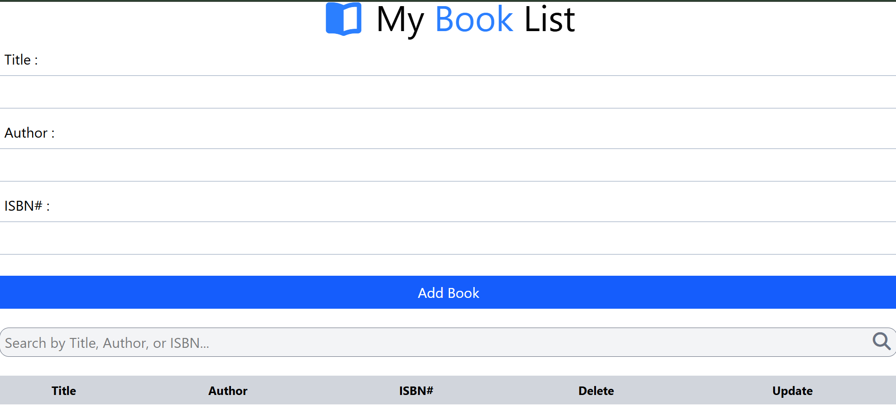

# 📚 My Book List

A simple Book List application built using **HTML**, **Tailwind CSS**, and **JavaScript**. This project allows users to add, update, delete, and search books. The data is stored in the browser using **Local Storage**, so books remain available even after refreshing the page.

---

## 🚀 Features

- ➕ Add new books
- ✏️ Update existing books
- ❌ Delete books
- 🔍 Search books by Title, Author, or ISBN
- 💾 Save data using Local Storage
- 📱 Simple and responsive user interface

---

## 🛠️ Technologies Used

- HTML5
- Tailwind CSS
- JavaScript (ES6)

---

## 📂 Project Structure

```
My-Book-List/
│── index.html
│── script.js
│── README.md
```

## 📖 How to Use

1. Enter the book **Title**, **Author**, and **ISBN**.
2. Click **Add Book** to save the book.
3. Click the **Update** button to edit a book.
4. Click the **Delete** button to remove a book.
5. Use the search box to find books by Title, Author, or ISBN.

---


## 📸 Screenshot


